# **Tobis "Remember The Colors" Game**

Live Website: [Tobis "Remember The Colors" Game](https://nixts.github.io/remember-the-colors/)

***
## **Purpose**

The website is an engaging and addictive Simon Says-style memory game that offers an exciting and challenging experience to players. With a sleek and user-friendly interface, the game captivates users from the moment they land on the start screen. Navigating through the different screens, including difficulty selection, gameplay, instructions, scores, and credits, is intuitive and seamless. 

The game's objective is simple yet stimulating: players must mimic a sequence of colored buttons that light up, testing their memory and concentration. The inclusion of two difficulty modes, each with distinct interval timings, adds depth to the gameplay and caters to players of various skill levels. Moreover, the website dynamically displays the player's current score. Overall, the website offers an engaging and entertaining experience that keeps players coming back to challenge their memory prowess.

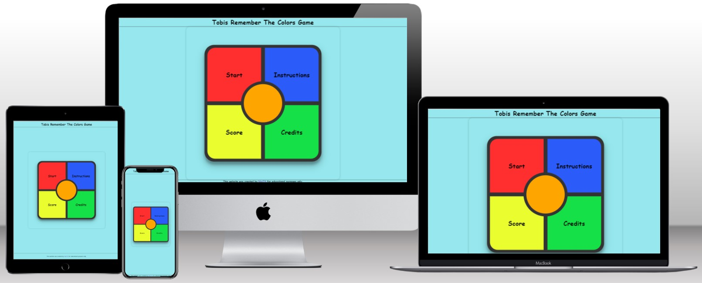

***

## **User Experience Design**

### **User stories**

#### **First Time Visitor Goals**

+ As a first time user, i want to play a short memory game with different difficulty settings.
+ As a first time user, i want to learn more about the game.
+ As a first time user, i want to know who created the website.

#### **Returning Visitor Goals**

+ As a returning user, i want to see my past highscores.

#### **Frequent Visitor Goals**

+ As a frequent user, if any updates has been made to the website.

### **Structure**

A difficulty setting has been added to add depth to the gameplay and cater to different players skill levels.
The purpose of this is to fulfill user story:
> As a first time user, i want to play a short memory game with different difficulty settings.

An instructions screen has been added to explain how this game works.
The purpose of this is to fulfill user story:
> As a first time user, i want to learn more about the game.

A credits screen has been added to explain who and how this game was created.
The purpose of this is to fulfill user story:
> As a first time user, i want to know who created the website.

A scores screen with a local storage has been added to save the users past scores and display the best three.
The purpose of this is to fulfill user story:
> As a returning user, i want to see my past highscores.

A credits screen has been added to allow the user to visit the creators website and see if any updates to the website have been made.
> As a frequent user, if any updates has been made to the website.

### **Design**

#### **Color Scheme**

+ Background
  + RGB Color Code: rgb(150, 232, 238) -  Turquoise
    + The utilization of a turquoise background color is deliberate, offering a seamless contrast to the game area while ensuring visual comfort

+ Border color
  + RGB Color Code: rgb(51, 51, 51); -  Dark Grey

+ Game Area
  + RGB Color Code: rgb(255, 47, 47); -  Red
  + RGB Color Code: rgb(43, 91, 248); -  Blue
  + RGB Color Code: rgb(233, 253, 47); - 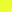 Yellow
  + RGB Color Code: rgb(21, 224, 72); - 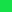 Green
    + These button colors were selected due to their high contrast, facilitating clear differentiation between each of them

#### **Typography**
**Comic Sans** is employed across the website for its playful style, which blends harmoniously with the overall design

***

## **Features**

### **Existing Features**

+ Tobis Remember The Colors Game Header
  + Featured at the top of the page, a simple header in text form. Showing the user the name of the game.

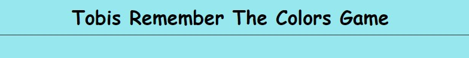

+ The Footer
  + Located at the bottom, a footer indication what this website and game is for.

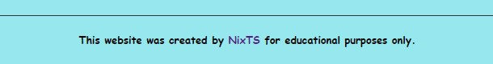

+ The Start Screen
  + This first section, the start screen is where the user navigates through the games functions.
  + The user will be able to click each button, guiding them to their desired section.

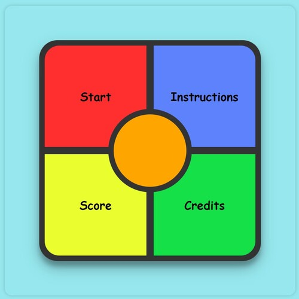

+ The Difficulty Selection
  + Upon clicking "Start" the user will have the choice to select a difficulty.
  + "Normal" With an interval timer of 600ms, the time between the colors glowing up
  + "Hard" With an interval timer of 350ms, the time between the colors glowing up

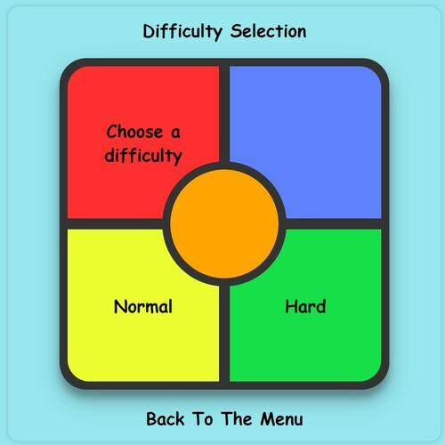

+ The Game Screen
  + Four big colored buttons for ease of gameplay on all devices.
  + A big "Go!" button in the center to show how to start the game.
  + An info bar on top, indicating to the user whats currently happening. 
    + Either to remember the next sequence, if the script is generating a new sequence, or to click the correct sequence of colors.

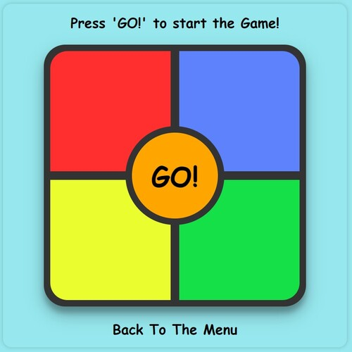

+ The End Card
  + If the user clicks the wrong color in the sequence, an end card will display, indicating the user that they lost the game.
  + Showing the score of the current game.

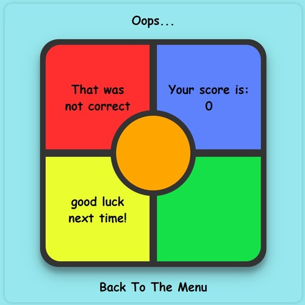

+ The Instructions Screen
  + An instructions screen, explaining how to play the game.

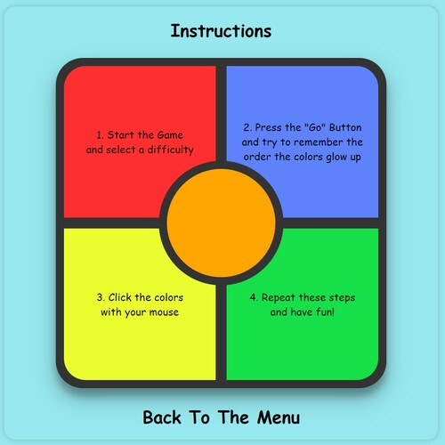

+ The Scores Screen
  + The scores screen will show the users highscores.
  + through a local storage, all scores will be saved here, for the user to see in every browser session.

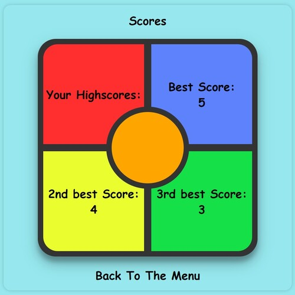

+ The Credits Screen
  + A simple credits screen showing who the creator of this website is.

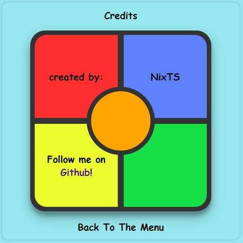

+ The Scores Display
  + After selecting a difficulty, a "Scores" display appear on top of the game.
  + Showing the current score after the user completes a sequence in the correct order.

+ The Turn "ON/OFF" Color Names Button.
  + After selecting a difficulty, a button will appear on top of the screen.
  + This button will turn on the colors names to help users with visual impairments or color blindness to enjoy this game.

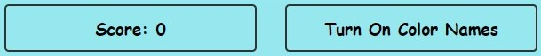
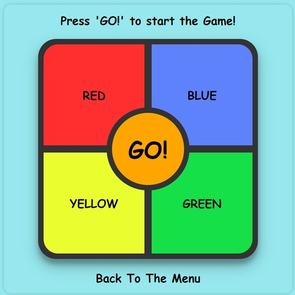

+ The Back To Menu Button
  + After clicking a button on the start screen, a back to menu button will display below the game area.
  + Clicking this button will refresh the page, leading the user back to the start screen.

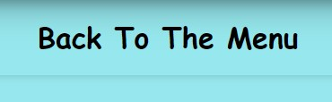

+ Favicon
  + A custom favicon has been added to show uniqueness and making the tab easier to find in the browser.

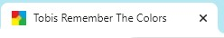

+ A custom "404"-Site
  + A custom 404-site has been added to lead the user back to the homepage, in case an incorrect URL is typed in.

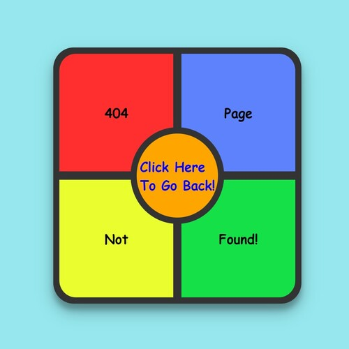

### **Features left to implement**

+ Third Difficulty Setting With A Timer Function
  + A third difficulty setting that lets the user play against a timer.
  + Adding more difficulty by decreasing the time to think about the correct sequence.

***

## **Technologies**

+ HTML
  + This project uses HTML as the main language used to complete the structure of the website.
+ CSS
  + This project uses custom written CSS to style the website.
+ JavaScript
  + This project uses custom written JavaScript as its only programming language.
+ [Codeanywhere](https://app.codeanywhere.com/)
  + Codeanywhere is a cloud-based integrated development environment (IDE) that allows developers to collaborate, write, and execute code from anywhere.
+ [GitHub](https://github.com/)
  + GitHub is the hosting website used to store the source code for the website and [Git Pages](https://pages.github.com/) is used for the deployment of the live website.
+ [Git](https://git-scm.com/)
  + Git is used as version control software to commit and push code to the GitHub repository where the source code is stored.
+ [Google Chrome Developer Tools](https://developers.google.com/web/tools/chrome-devtools)
  + Google chromes built in developer tools are used to inspect page elements and help debug issues with the website layout and test different CSS styles.
+ [balsamiq Wireframes](https://balsamiq.com/wireframes/)
  + This was used to create wireframes for 'The Skeleton Plane' stage of UX design.
+ [Favicon](https://favicon.io/)
  + Favicon.io was used to make the websites favicon
+ [Techsini](http://techsini.com/multi-mockup/index.php)
  + techsini.com Multi Device website Mock-Up Generator was used to create the Mock-Up image in this README

***

## **Testing**

+ Testing is required on Tobis Remember The Colors responsive website.
+ The script must work correctly and reflect the intended functionality.
+ Testing is to be done on the most common browsers such as Chrome, Opera, Firefox, Safari and Edge.
+ Testing it to be done on the most common devices such as Samsung, Apple and Huawei.
+ No elements should overlap another container div. All elements should remain on the screen at all sizes above 320px.
+ All external links must open in a new tab.

### **Procedure**

#### **Validator testing**

+ HTML
  + No errors were returned when passing through the official [W3C validator](https://validator.w3.org/nu/?doc=https%3A%2F%2Fnixts.github.io%2Fremember-the-colors%2F)
+ CSS
  + No errors were found when passing through the official [(Jigsaw) validator](http://jigsaw.w3.org/css-validator/validator?lang=de&profile=css3svg&uri=https%3A%2F%2Fnixts.github.io%2Fremember-the-colors%2F&usermedium=all&vextwarning=&warning=1)
+ JavaScript
  + No errors were found when passing through the official [Jshint validator](https://jshint.com/)
  + There are 27 functions in this file.
  + Function with the largest signature take 2 arguments, while the median is 0.
  + Largest function has 16 statements in it, while the median is 5.
  + The most complex function has a cyclomatic complexity value of 4 while the median is 1.

#### **Responsiveness**

1. Open deployed website in Chrome browser
2. Right-clicking an element on the website
3. Select 'Inspect Element' to open Chrome Developer Tools

Test criteria are:

+ Does each div have enough space between one another?
+ Are all texts and headers correctly displayed and readable?

Testing by this method is to evaluate responsiveness on various screen sizes and swiftly address bugs and errors before implementing permanent solutions.

This test was repeated using the different browsers mentioned in the summary section above.

### **Other Tests**

A Chrome DevTools Lighthouse test has been performed with the following results:

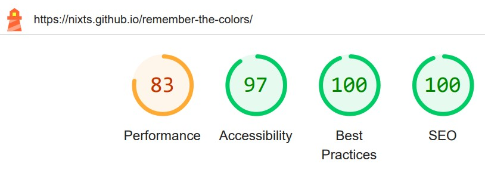

How to perform a Chrome DevTools Lighthouse test:

1. Open a website with the Google Chrome browser
2. Right click anywhere on the website and click "inspect" in the dropdown menu to open Chrome DevTools
3. Open more tabs by clicking on the double arrows on the top and select "Lighthouse"
4. Select Mode, Device, Categories and Plugins
5. Click "Analyze page load"
6. After a short waiting time the result will be displayed

### **Unresolved Errors, Issues and Bugs**

+ Double Clicking Bug
  + While playing the game and its the users turn to click the correct sequence an error may occur if:
    + The user double clicks the color button in a very quick succession
  + This issue has been tested with: 
    + A mouse recorder to meassure the time between clicks for this bug to occur
  + The result was:
    + The time between clicks has to be smaller than 120ms
  + This bug has not been resolved yet, because:
    + The underlying issue has not been occured during normal gaming sessions, only during the testing phase, in which the game was tested to its limits. 

***

## **Deployment**

### **Project Creation**

The project was started by navigating to the [template](https://github.com/Code-Institute-Org/gitpod-full-template) and clicking 'Use this template'. Under Repository name I input woodworking-club and checked the 'Include all branches' checkbox. I then navigated to the new [repository](). I then clicked the Code drop down and selected HTTPS and copied the link to the clipboard.

Opening [Codeanywhere](https://app.codeanywhere.com/) and clicking 'New Workspace', I then pasted the [repository link](https://github.com/NixTS/remember-the-colors.git) into the URL field and clicked 'Create'. The following commands were used throughout the project:

+ git add filename - This command was used to add files to the staging area before committing.
+ git commit -m *commit message explaining the updates* - This command was used to commit changes to the local repository.
+ git push - This command is used to push all committed changes to the GitHub repository.

### **Using GitHub Pages**

1. Navigate to the GitHub [Repository:](https://github.com/NixTS/remember-the-colors)
2. Click the 'Settings' Tab.
3. Scroll Down to the Git Hub Pages Heading.
4. Select 'main Branch' as the source.
5. Click the Save button.
6. Click on the link to go to the live deployed page.

### **Run Locally**

1. Navigate to the GitHub [Repository:](https://github.com/NixTS/remember-the-colors)
2. Click the Code drop down menu.
3. Either Download the ZIP file, unpack locally and open with IDE OR Copy Git URL from the HTTPS dialogue box.
4. Open your development editor of choice and open a terminal window in a directory of your choice.
5. Use the 'git clone' command in terminal followed by the copied git URL.
6. A clone of the project will be created locally on your machine.

***

## **Credits**

### **Content**

+ The idea for this game stems from the popular "Simon Game" developed by Hasbro. I had a "Simon Game" as a child and my goal was to create and online version of this game to arouse nostalgic feelings.
+ The content of this website was created by [Tobias Schmauder aka. NixTS](https://github.com/NixTS).
+ The JavaScript code provided was made with the knowledge gained through the CodeInstitute Full Stack Developer course.

### **Acknowledgements**
I'd like to thank my mentor Daisy McGirr for her guidance throughout my project.